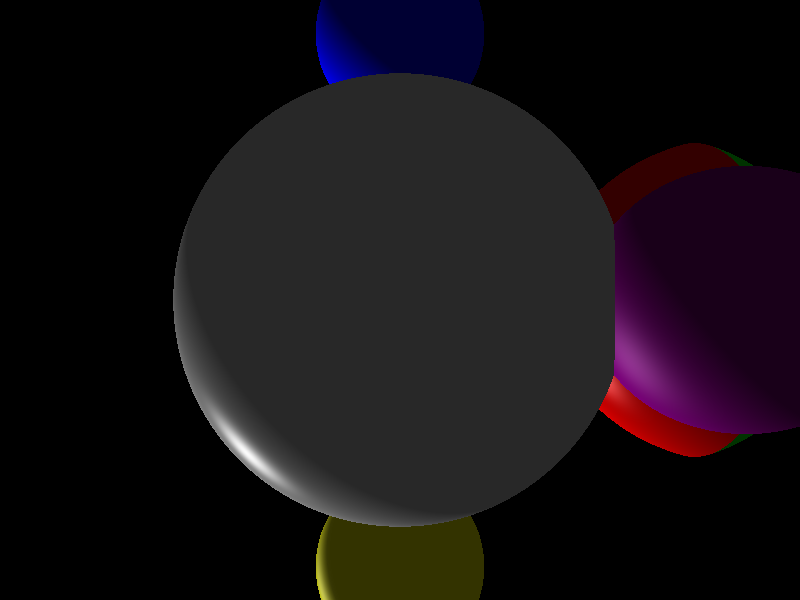
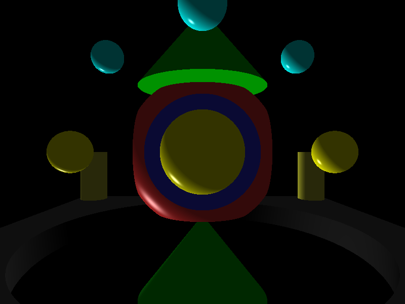
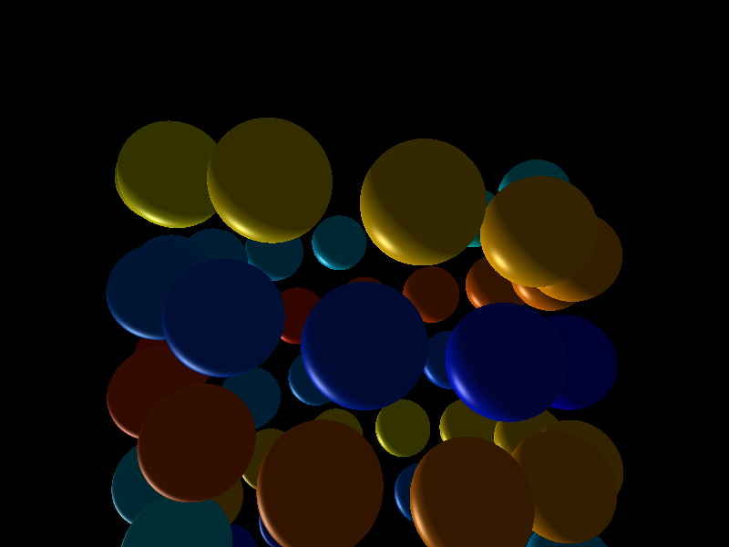

# CSG Ray Casting

Interaktywny ray tracer bry? CSG (Constructive Solid Geometry) dzia?aj?cy na CPU lub GPU przez CUDA. Sceny sk?adaj? si? z prymityw?w ??czonych operacjami sumy, cz??ci wsp?lnej i r??nicy, a wynik jest wy?wietlany w oknie SDL2.

## Przyk?adowe rendery

| Operacje CSG | Scena przemys?owa | Helisa |
| --- | --- | --- |
|  |  |  |

## Wymagania

- Windows 10 lub 11
- CMake 3.18 lub nowszy
- Visual Studio 2022 z narz?dziami C++
- NVIDIA CUDA Toolkit
- karta NVIDIA obs?uguj?ca CUDA ? tylko dla trybu `gpu`

CMake najpierw szuka zainstalowanego SDL2. Je?li go nie znajdzie, pobiera przypi?t? wersj? SDL 2.32.10 podczas pierwszej konfiguracji.

## Kompilacja

Z katalogu g??wnego repozytorium uruchom:

```powershell
cmake -S CSGRayCast -B build
cmake --build build --config Release
```

Dla generatora Visual Studio plik wykonywalny zostanie utworzony jako `build\Release\CSGRayCast.exe`.

## Testy

Testy jednostkowe dzia?aj? na CPU i nie wymagaj? aktywnego urz?dzenia CUDA:

```powershell
cmake -S CSGRayCast -B build -DBUILD_TESTING=ON
cmake --build build --config Release --target CSGRayCastTests
ctest --test-dir build -C Release --output-on-failure
```

## Uruchomienie

Program wymaga trybu renderowania i ?cie?ki do pliku sceny:

```text
CSGRayCast.exe <cpu|gpu> <plik_sceny> [output.bmp]
```

Przyk?ady uruchomione z katalogu g??wnego repozytorium:

```powershell
.\build\Release\CSGRayCast.exe gpu helix_complex.txt
.\build\Release\CSGRayCast.exe cpu industrial_complex.txt
```

Opcjonalny trzeci argument renderuje jedn? klatk? w ukrytym oknie, zapisuje j? jako BMP i ko?czy program:

```powershell
.\build\Release\CSGRayCast.exe cpu complex_scene.txt render.bmp
```

Tryb `cpu` nie wymaga karty NVIDIA do renderowania. Tryb `gpu` przenosi drzewo sceny i obliczenia promieni na urz?dzenie CUDA.

## Sterowanie

- **Strza?ki:** obr?t kamery wok?? punktu obserwacji.
- **W/S/A/D:** obr?t kierunku ?wiat?a.
- **Zamkni?cie okna:** zako?czenie programu.

## Format plik?w scen

Scena jest pojedynczym binarnym drzewem CSG zapisanym w porz?dku pre-order. Wci?cia nie wp?ywaj? na parser, ale u?atwiaj? odczyt struktury. Ka?da niepusta linia opisuje operator albo prymityw.

### Operatory CSG

Ka?dy operator przyjmuje dok?adnie dwa poddrzewa zapisane bezpo?rednio po nim:

- `union` ? suma bry? `A ? B`,
- `intersection` ? cz??? wsp?lna `A ? B`,
- `difference` ? r??nica `A \ B`.

### Materia?

Ka?da linia prymitywu ko?czy si? sze?cioma warto?ciami materia?u:

```text
r g b diff spec shin
```

- `r g b` ? sk?adowe koloru w zakresie od 0 do 1,
- `diff` ? wsp??czynnik odbicia rozproszonego,
- `spec` ? wsp??czynnik odbicia lustrzanego,
- `shin` ? wyk?adnik po?yskliwo?ci.

### Prymitywy

| Prymityw | Sk?adnia | Znaczenie pozycji |
| --- | --- | --- |
| Kula | `sphere x y z radius [materia?]` | ?rodek kuli |
| Prostopad?o?cian | `cuboid x y z w h d [materia?]` | minimalny naro?nik |
| Walec | `cylinder x y z radius height [materia?]` | ?rodek dolnej podstawy |
| Sto?ek | `cone x y z radius height [materia?]` | ?rodek dolnej podstawy |

Walec i sto?ek s? ustawione wzd?u? osi Y. Warto?? `height` okre?la odleg?o?? od dolnej podstawy w kierunku dodatnim osi Y.

### Przyk?ad sceny

```text
difference
  sphere 0.0 0.0 0.0 1.4 1.0 0.2 0.2 0.8 0.6 64
  cuboid -1.1 -1.1 -1.1 2.2 2.2 2.2 0.2 0.2 1.0 0.8 0.5 32
```

Ten zapis odejmuje prostopad?o?cian od kuli.

## Generator scen

Skrypt `gen_scene.py` tworzy proceduralne sceny miejskie o przybli?onej liczbie w?z??w:

```powershell
python gen_scene.py 500 generated_city.txt
```

W repozytorium znajduj? si? r?wnie? gotowe sceny, od prostych przypadk?w z jedn? bry?? po du?e drzewa `big_city.txt` i `large_city.txt`.

## Jak dzia?a renderer

### Przeci?cia i operacje CSG

Ka?dy prymityw zwraca przedzia? `Span`, w kt?rym promie? znajduje si? wewn?trz bry?y. Przedzia? zawiera czasy wej?cia i wyj?cia (`t_entry` oraz `t_exit`), normalne powierzchni i identyfikator materia?u.

Operatory ??cz? posortowane przedzia?y:

- **Union:** scala zachodz?ce na siebie przedzia?y.
- **Intersection:** zachowuje wy??cznie ich wsp?ln? cz???.
- **Difference:** usuwa z przedzia??w lewego obiektu fragmenty nale??ce do prawego obiektu.

Najbli?sze dodatnie przeci?cie po wykonaniu ca?ego drzewa s?u?y do obliczenia koloru piksela.

### P?aska reprezentacja drzewa

`FlatCSGTree` przechowuje drzewo w tablicach zamiast w strukturze opartej na wska?nikach. Topologia znajduje si? w tablicach `nodes`, `left_indexes` i `right_indexes`, a dane prymityw?w i materia??w s? skompaktowane osobno.

Renderer przetwarza indeksy w porz?dku post-order. Dzi?ki temu mo?e oblicza? wynik iteracyjnie za pomoc? stosu i u?ywa? tej samej reprezentacji na CPU oraz GPU.

### Pami?? CPU i GPU

Renderer CPU przydziela bufory robocze raz na klatk? i wykorzystuje je ponownie dla kolejnych promieni.

Renderer GPU wyznacza wymagany rozmiar puli przed startem kernela. Globalny bufor jest dzielony mi?dzy piksele, a rendering odbywa si? partiami ograniczonymi bud?etem pami?ci. Topologia drzewa i dane prymityw?w s? kopiowane do pami?ci wsp??dzielonej dla ka?dego bloku w?tk?w.

## Struktura projektu

- `CSGRayCast/main.cu` ? punkt wej?cia, obs?uga SDL oraz rendering CPU/GPU.
- `CSGRayCast/tracer.cu` ? ?ledzenie promieni, operacje na przedzia?ach i kernel CUDA.
- `CSGRayCast/shape.h` ? analityczne przeci?cia kuli, prostopad?o?cianu, walca i sto?ka.
- `CSGRayCast/csg.h` ? p?aska reprezentacja drzewa CSG.
- `CSGRayCast/loadfile.cpp` ? parser plik?w scen.
- `CSGRayCast/rayCast.h` ? wektory, promienie, kamera, ?wiat?o i kolory.
- `gen_scene.py` ? generator proceduralnych scen miejskich.
